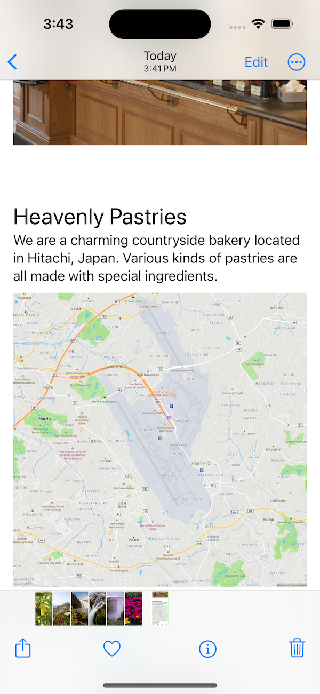

# Restaurant: A Swift-based Clone of [Original Food Review Platform]
 

## Overview
Restaurant is an iOS app developed in Swift.  Users can browse the restaurant around them.

## Features

- Browse restaurants by location
- Admin panel for restaurant owners
- You can see various dishes in the gallery.


## Getting Started

### Prerequisites

- Xcode 13.0 or later
- iOS 15.0 or later
- CocoaPods for dependency management

### Installation

1. Clone the repository:
    ```
    git clone https://github.com/Miyuki-yuki/Restaurant.git
    ```

2. Install dependencies:
    ```
    cd Restaurant
    pod install
    ```

3. Open `Restaurant.xcworkspace` in Xcode

4. Build and run the project

## Usage

After logging in, you can browse restaurants based on your location. You can also rate and review restaurants you've visited.

## Contributing

Please read [CONTRIBUTING.md](https://link-to-your-contributing-guidelines) for details on our code of conduct and the process for submitting pull requests.

## License

This project is licensed under the MIT License 


